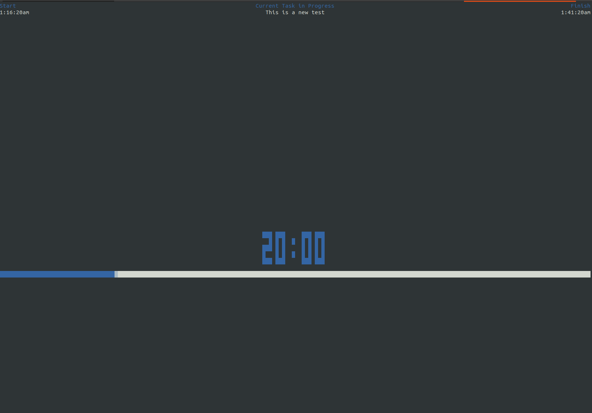

# pomodoro
Command line [pomodoro timer](https://en.wikipedia.org/wiki/Pomodoro_Technique), implemented in Go.  This code is a modifed version of the timer at https://github.com/carlmjohnson/pomodoro 

## Installation
First install [Go](http://golang.org).

If you just want to install the binary to your current directory and don't care about the source code, run

```bash
go install github.com/aringo/pomodoro@latest
```

## Usage
Usage of pomodoro:

    pomodoro [options] [finish time]
    
    pomodoro -task="Working on Pomodoro"

Duration defaults to 25 minutes. Finish may be a duration (e.g. "1h2m3s")
or a target time (e.g. "1:00pm" or "13:02:03"). Durations may be expressed
as integer minutes (e.g. "15") or time with units (e.g. "1m30s" or "90s").

Chimes system bell at the end of the timer, unless -silence is set.

Creates a pomodoro.log file in the users home directory. 

## Screenshots
```bash
$ pomodoro -simple
Start timer for 25m0s.

Countdown: 24:43

$ pomodoro -h
Usage of pomodoro v0.0.0-20220214014922-cc7279d5c368:

    pomodoro [options] [finish time]

Duration defaults to 25 minutes. Finish may be a duration (e.g. "1h2m3s")
or a target time (e.g. "1:00pm" or "13:02:03"). Durations may be expressed
as integer minutes (e.g. "15") or time with units (e.g. "1m30s" or "90s").

Chimes system bell at the end of the timer, unless -silence is set.
  -silence
        Don't ring bell after countdown
  -simple
        Display simple countdown
  -task string
        task to be tracked (default "un-named task")
```



## Recommended helper
[Noti](https://github.com/variadico/noti) can be used to bring up a system alert when pomodoro finishes.
